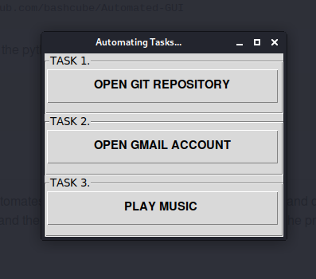

# Automated-GUI
  * ## Requirements:
      The system must have mpg123 installed in order to run the task.
      Download it using command:
      ```bash
      $ sudo apt-get install mpg123
      $ sudo apt-get install firefox
      ```
      
  * ## Usage:
      Clone the repo on your local machine using command:
      ```bash
      $ git clone https://github.com/bashcube/Automated-GUI
      ```
      Change the directory and run the pythn file using command:
      ```bash
      $ cd Automated-GUI
      $ python tasks.py
      ```
      
   * ## Description:
       The following python code automates three most done tasks 
       through simple GUI and displays the result accordingly.
       The python file contains the code and the text file contains the 
       process of automating the program to start at boot.
       
   * ## Output:
      
